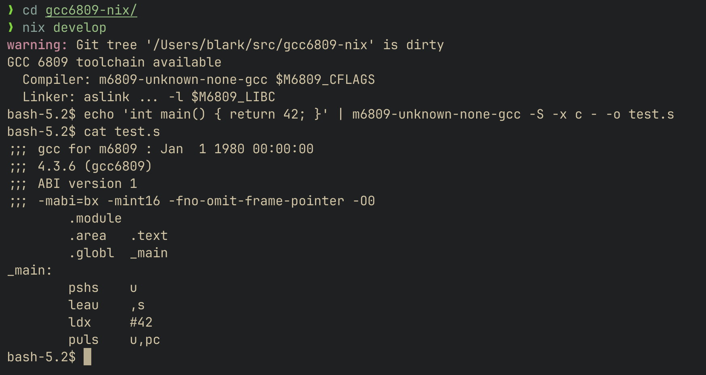

# gcc6809-nix

Nix flake for building a GCC 4.3.6 cross-compiler targeting the Motorola 6809 CPU on macOS ARM64 (Apple Silicon).

## Requirements

Nix package manager with flakes enabled. If you're new to Nix on macOS, see [Setting up Nix on macOS](https://nixcademy.com/posts/nix-on-macos/) for installation and setup.

## Quick Start

```bash
# Build the toolchain
nix build

# Enter a shell with the toolchain available
nix develop

# Compile a test program
echo 'int main() { return 42; }' > test.c
m6809-unknown-none-gcc -S test.c -o test.s
```



## What's Included

- **m6809-unknown-none-gcc** - GCC 4.3.6 cross-compiler
- **as6809** - ASxxxx assembler
- **aslink** - ASxxxx linker
- **libc.a** - Newlib C library

## Linking with libc

```bash
cd example
nix develop ..
m6809-unknown-none-gcc -Os -S $M6809_CFLAGS hello.c -o hello.s
as6809 -o hello.s
aslink -s -m -w -o hello.s19 -b .text=0x2000 hello.rel -l $M6809_LIBC
```

## Platform Support

Currently only supports `aarch64-darwin` (Apple Silicon Macs) due to ARM64-specific patches required to build GCC 4.3.6.

## License

- GCC: GPL-3.0-or-later
- Newlib: BSD-3-Clause
- Patches in this repo: Same license as the code they patch
