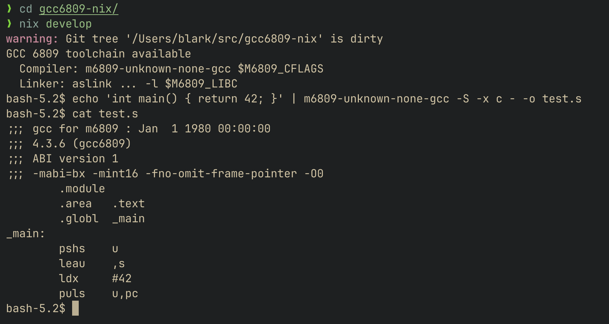

# gcc6809-nix

Nix flake for building a GCC 4.3.6 cross-compiler targeting the Motorola 6809 CPU on macOS ARM64 (Apple Silicon).

## Requirements

Nix package manager with flakes enabled. If you're new to Nix on macOS, see [Setting up Nix on macOS](https://nixcademy.com/posts/nix-on-macos/) for installation and setup.

## Quick Start

```bash
# Build the toolchain
nix build

# Enter a shell with the toolchain available
nix develop

# Compile a test program
echo 'int main() { return 42; }' > test.c
m6809-unknown-none-gcc -S test.c -o test.s
```



## What's Included

- **m6809-unknown-none-gcc** - GCC 4.3.6 cross-compiler
- **as6809** - ASxxxx assembler
- **aslink** - ASxxxx linker
- **libc.a** - Newlib C library

## Linking with libc

```bash
cd example
nix develop ..
m6809-unknown-none-gcc -Os -S hello.c -o hello.s
as6809 -o hello.s
aslink -s -m -w -o hello.s19 -b .text=0x2000 hello.rel -l $M6809_LIBC
```

This manual `aslink` flow omits the installed GCC `crt0.o`: it enters your
program without startup initialization. In particular, BSS contains whatever
was already in RAM; use the normal GCC driver link when your program relies
on crt0 to clear BSS or run constructors: `m6809-unknown-none-gcc hello.c -o
hello.s19` compiles and links with newlib's headers, `crt0.o` and `libc.a`, no
paths needed. The installed-startup test and exact contract are
in [tests/review/STARTUP.md](tests/review/STARTUP.md).

## Formatting

Use the formatter from the locked nixpkgs revision:

```bash
nix fmt -- flake.nix
```

Pass a file explicitly: the pinned nixfmt reads stdin when no files are given.
`nix flake check` checks formatting as well as the existing driver link test.

## Running Tests

```bash
nix run .#test            # all cases, or: nix run .#test -- long_
nix develop -c python3 -B tests/run_tests.py
```

Every `tests/cases/*.c` is compiled at -O0, -Os and -O2, run on the MC6809
emulator, and its result compared with the file's `// EXPECT:` comment. The
cases cover basic operations, 32-bit arithmetic and arguments, indirect calls,
setjmp/longjmp and regression tests for fixed compiler and libc bugs.
`GCC6809_OPT="-Os"` limits the optimization levels, `GCC6809_TOOLCHAIN=/path`
picks another toolchain. `tests/review/run_longjmp_review.py --exhaustive`
additionally runs libc's `_longjmp` for every 16-bit `val`,
`tests/review/run_divmod_review.py` runs libgcc's 16-bit divide/modulo
helpers for every 16-bit dividend against representative divisors, and
`tests/review/run_mulsi3_review.py` runs the 32-bit and 16-bit multiply
helpers over edge, per-byte-position and random operand pairs.

## Emulator dependency

Tests use the CPU-only `mc6809` package from
[anachron8-emu](https://git.sherwood.haus/blark/anachron8-emu), pinned in
`flake.lock`. Its overlay extends `pythonPackagesExtensions`, so
`pkgs.python3Packages.mc6809` supplies the vendored, corrected CPU to both
`nix run .#test` and `nix develop`. The `MC6809` import/API is unchanged;
the machine model is not installed. The SEX fix now lives in that fork,
not in a local PyPI recipe or patch.

Python scripts are **Nix-only**: use `nix develop -c python3 -B ...` for
`tests/run_tests.py`, `tests/debug_mulsi3.py`, and every tracked
`tests/review/*.py` script. Their upstream PEP 723 metadata has been removed.
Standalone `uv run`/PyPI dependency resolution is unsupported because it can
install an uncorrected CPU and invalidate results.

Run the full suite and exhaustive reviews with the same pinned environment:

```bash
export GCC6809_OPT="-O0 -O1 -O2 -O3 -Os"
nix run .#test
nix develop -c python3 -B tests/review/check_sex_opcode.py
nix develop -c python3 -B tests/review/run_bit_helpers.py --exhaustive
nix develop -c python3 -B tests/review/run_divmod_review.py --jobs 8
nix develop -c python3 -B tests/review/run_longjmp_review.py --include-suite --exhaustive
nix develop -c python3 -B tests/review/run_mulsi3_review.py --jobs 8
nix develop -c python3 -B tests/review/run_signed_mul_review.py --exhaustive
```

## Patches

This build includes fixes for several m6809 backend and libc bugs. See [patches/README.md](patches/README.md) for details:

- **arm64-darwin.patch** - Fixes for building GCC 4.3.6 on Apple Silicon
- **mulsi3-fix.patch** - Fixes 32-bit multiplication returning 0
- **movsi-fix.patch** - Long arguments were pushed with their words swapped; 32-bit constants crashed the compiler
- **indirect-call-stack-offset.patch** - Indirect calls with pushed arguments used a stale stack offset
- **newlib-m6809.patch** - The m6809 port of newlib 1.15.0
- **newlib-longjmp-zero.patch** - `longjmp(env, 0)` now returns 1 from `setjmp` (C99 7.13.2.1)

## Platform Support

Currently only supports `aarch64-darwin` (Apple Silicon Macs) due to ARM64-specific patches required to build GCC 4.3.6.

## License

- GCC: GPL-3.0-or-later
- Newlib: BSD-3-Clause
- Patches in this repo: Same license as the code they patch
